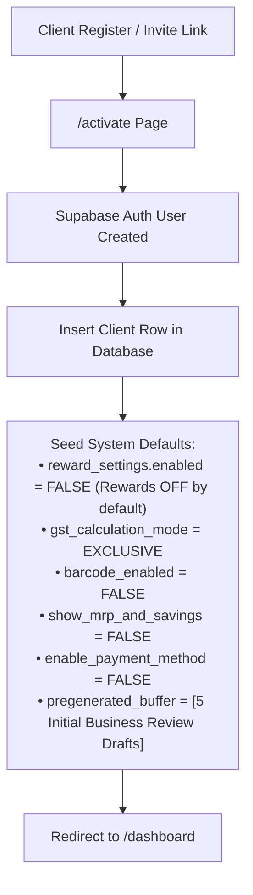
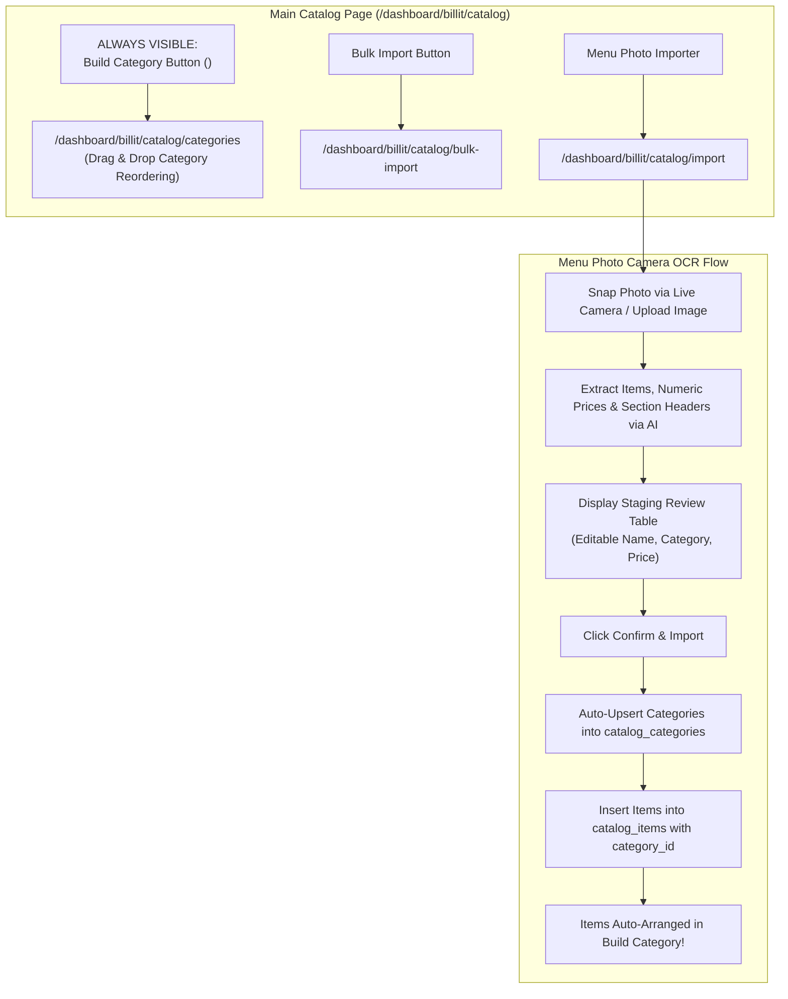
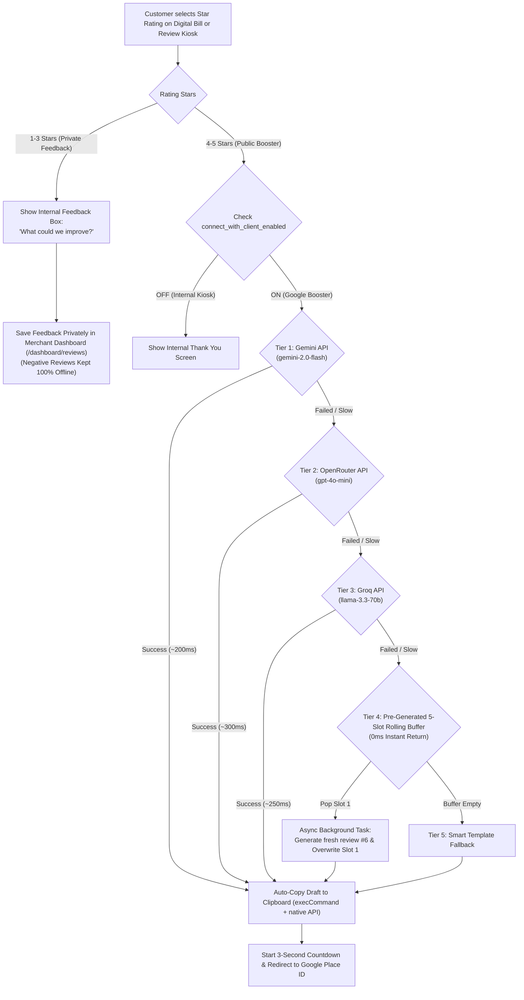
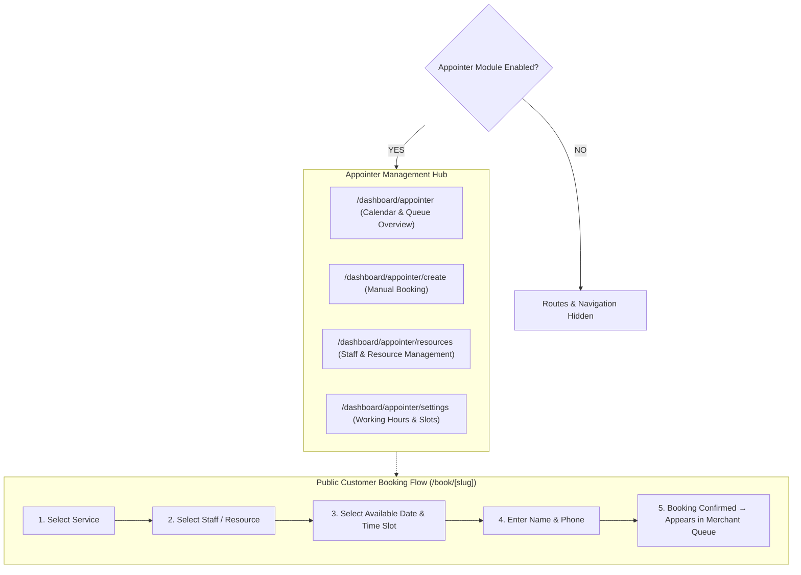

# BillDoor — Complete 360° System Architecture, Toggle Matrix & End-to-End User Flow Guide

This master reference document provides an exhaustive inventory of every feature, setting, toggle state (ON/OFF conditions), database interaction, and user workflow across **BillDoor** (by Orbitex).

---

## 1. Complete Feature & Settings Inventory

### A. Business Identity & Account Management
1. **Responsive Logo Rendering (`logo_url`)**:
   - Client uploads square or wide rectangular logo in Settings (`/dashboard/settings`).
   - Saved to Supabase Storage (`public-assets/logos`).
   - Rendered on a clean **solid white background (`#ffffff`)** with responsive aspect ratio (`max-width: 180px–220px`, `max-height: 72px–90px`, `object-fit: contain`) across Digital Bills, Business Cards, Review Kiosks, Public Catalogs, and Settings Previews.
2. **Business Information Profile**:
   - Business Name, Owner Name, Business Type, Address, Google Place URL, Google Maps Embed URL, Business Email, Phone, WhatsApp URL, Instagram/Facebook/Website links.
3. **Account Password Change**:
   - Form fields: `Current Password *`, `Enter New Password *`, `Re-enter New Password *`.

### B. Billit — Billing & POS Settings (ON / OFF Toggles)
4. **GST Enable / Disable Toggle (`has_gst`)**:
   - **ON**: Enables GSTIN input, Tax Invoice headers, CGST/SGST/IGST split, GST Slab Breakup table, and GST Reports (`/reports/gst-summary`).
   - **OFF**: Hides GST fields; bills display as standard Sales Receipts.
5. **GST Calculation Mode Toggle (`gst_calculation_mode`)**:
   - **Exclusive (Add GST on top)**: Price entered = base price. Tax added on top (e.g. ₹100 + 18% GST = **₹118 Total**).
   - **Inclusive (GST in price)**: Price entered = final price including tax. Tax extracted backward (e.g. ₹100 with 10% GST = **₹90.91 Taxable + ₹9.09 GST = ₹100 Total**).
6. **Show CGST / SGST Split Toggle (`show_cgst_sgst_split`)**:
   - **ON**: Displays CGST (50%) + SGST (50%) rows separately on Digital Bills.
   - **OFF**: Displays combined GST amount.
7. **Show GST Slab Breakup Table Toggle (`show_gst_slab_breakup`)**:
   - **ON**: Displays rate-wise GST breakdown table (0%, 5%, 12%, 18%, 28%) on Digital Bills.
   - **OFF**: Hides slab table.
8. **Enable MRP & Savings Toggle (`show_mrp_and_savings`)**:
   - **ON**: Adds MRP input field to catalog items. Displays "🎉 You Saved ₹X on MRP!" badge on Digital Bills when MRP > Selling Price.
   - **OFF**: Hides MRP input and savings badge.
9. **Enable Payment Method Selector Toggle (`enable_payment_method`)**:
   - **ON**: Adds Payment Method selector (Cash, UPI, Credit Card, Debit Card, Other) to Create Bill. Displays "Paid via: UPI" on Digital Bills.
   - **OFF**: Hides payment method selector.
10. **POS Mode & Sticky Running Total Toggle (`pos_mode_enabled`)**:
    - **ON**: Enables mobile-optimized calculator view, PC keyboard hotkeys, and pins the **POS Running Total Bar** (`top: 0; z-index: 99`) to stay stuck at top during scrolling.
    - **OFF**: Standard multi-column billing layout.
11. **Barcode Mode Toggle (`barcode_enabled`)**:
    - **ON**: Auto-assigns scannable barcodes (`ITM001`) to catalog items, shows barcode column in tables, and enables USB/Camera scanner lookup.
    - **OFF**: Hides barcode fields from quick creation screens while retaining stored barcodes in memory.
12. **Camera Barcode Scanner Toggle (`camera_barcode_enabled`)**:
    - **ON**: Shows camera barcode scanner button on Create Bill screen.
13. **Default Pricing & Tax Defaults**:
    - Default GST %, Default Discount Type (₹ / %), Default Discount Value, Default Bill Size (Thermal 80mm vs Standard A4).
14. **Multi-Template Auto-Select Toggle (`billit_auto_select_template`)**:
    - **ON**: Automatically switches bill template based on customer visit count (First Visit Template vs Repeat Visit Template).
    - **OFF**: Uses client's single default bill template.

### C. Catalog & Category Building
15. **Build Category Button (ALWAYS ON)**:
    - Permanent `<LayoutGrid /> Build Category` button in main catalog header (`/dashboard/billit/catalog`).
    - Drag & drop category reordering, show/hide in catalog toggle (`show_in_catalog`), availability toggle (`is_available`).
16. **Catalog Import Modes (`/bulk-import` & `/import`)**:
    - **CSV Upload**: Import spreadsheet (`Name, Price, Category, Type, GST, Barcode`).
    - **Direct Paste CSV / AI Output**: Paste raw CSV or AI chat text into textarea.
    - **Copyable AI Prompt & Guide**: Step-by-step instructions for Gemini/ChatGPT/Grok.
    - **Live Camera & Menu Photo OCR**: Snap menu photo with camera or upload image → AI extracts items + prices + categories → auto-creates categories in Build Category.

### D. Review Flow & Reward System Settings
17. **Enable Rewards System Toggle (`reward_settings.enabled`)**:
    - **OFF (Default)**: **Completely hides Reward Code (optional) input field** and all reward mentions from Create Bill screen.
    - **ON**: Shows reward code input, validates codes (`SAVE10-X4F9`), and applies discounts.
18. **Public Google Booster vs. Internal Kiosk Toggle (`connect_with_client_enabled`)**:
    - **ON (Public Google Booster)**: 4–5 star ratings trigger 5-Tier AI review draft generation, auto-copy draft to clipboard without permission prompt, and start 3-second countdown redirect to Google Place ID.
    - **OFF (Internal Feedback Kiosk)**: 4–5 star ratings display internal Thank You screen directly without AI or Google redirect.
19. **1–3 Star Private Feedback Path**:
    - 1–3 star ratings prompt "What could we improve?" and save feedback privately to merchant's internal dashboard (`/dashboard/reviews`), keeping negative reviews completely offline.
20. **5-Tier AI Review Generation Pipeline**:
    - **Tier 1**: Gemini API (`gemini-2.0-flash` → `gemini-1.5-flash` → `gemini-flash-latest`)
    - **Tier 2**: OpenRouter API (`openai/gpt-4o-mini`)
    - **Tier 3**: Groq API (`llama-3.3-70b-versatile` → `llama-3.1-8b-instant`)
    - **Tier 4**: **Pre-Generated 5-Slot Rolling Buffer** (0ms instant return + async background overwrite replenishment)
    - **Tier 5**: Smart Business-Aware Template Fallback.

### E. Appointer (Appointments & Scheduling) Module
21. **Appointer Module Toggle (`modules_enabled.appointer`)**:
    - **ON**: Unlocks `/dashboard/appointer`, `/create`, `/resources`, `/settings`, and public booking page `/book/[slug]`.
    - **Booking Flow**: Service Selection → Staff/Resource Selection → Date & Time Slot Selection → Booking Confirmation.

### F. WhatsApp Auto Module
22. **WhatsApp Auto Module Toggle (`modules_enabled.whatsapp_auto`)**:
    - **ON**: Enables automated WhatsApp bill delivery and broadcast campaigns (`/dashboard/whatsapp`).
    - **OFF**: Provides manual `wa.me` links to send bills via WhatsApp.

---

## 2. Client Activation & Account Initialization Diagram



---

## 3. Master Settings & Toggle Control Matrix

```mermaid
flowchart TD
    subgraph SETTINGS_HUB["Settings Hub (/dashboard/settings & /dashboard/billit/settings)"]
        S_GST["GST Toggle (has_gst)"]
        S_MODE["GST Mode (gst_calculation_mode)"]
        S_REWARD["Enable Rewards (reward_settings.enabled)"]
        S_POS["POS Mode (pos_mode_enabled)"]
        S_BARCODE["Barcode Mode (barcode_enabled)"]
        S_BOOSTER["Google Booster (connect_with_client_enabled)"]
        S_APPOINTER["Appointer Module (modules_enabled.appointer)"]
        S_MRP["MRP & Savings (show_mrp_and_savings)"]
        S_PAY["Payment Method (enable_payment_method)"]
    end

    subgraph EFFECT_CREATE_BILL["Create Bill Screen (/dashboard/billit/create)"]
        S_REWARD -- "OFF (Default)" --> HIDE_REWARD["HIDE Reward Code Input & All Reward Mentions"]
        S_REWARD -- "ON" --> SHOW_REWARD["SHOW Reward Code (optional) Input Field"]
        
        S_POS -- "ON" --> STICKY_BAR["Pin POS Running Total Bar to top (top: 0; z-index: 99)"]
        S_BARCODE -- "ON" --> SCANNER["Show Barcode Column & USB/Camera Scanner"]
        S_PAY -- "ON" --> PAY_SELECT["Show Payment Method Dropdown (Cash/UPI/Cards)"]
    end

    subgraph EFFECT_BILLING_MATH["Billing Math Engine (billing-math.ts)"]
        S_MODE -- "EXCLUSIVE" --> EX_MATH["Taxable = Base Price<br/>GST = Base * Rate%<br/>Total = Base + GST (₹100 + 18% = ₹118)"]
        S_MODE -- "INCLUSIVE" --> IN_MATH["Taxable = Final / (1 + Rate%)<br/>GST = Final - Taxable<br/>Total = Final (₹100 with 10% = ₹90.91 + ₹9.09)"]
    end

    subgraph EFFECT_REVIEW_FLOW["Public Review Flow (/review/[slug])"]
        S_BOOSTER -- "ON (Booster)" --> RUN_AI["4-5★ Ratings: Trigger 5-Tier AI Pipeline,<br/>Auto-Copy to Clipboard & 3s Redirect to Google"]
        S_BOOSTER -- "OFF (Kiosk)" --> SHOW_THANKYOU["4-5★ Ratings: Show Internal Thank You Screen"]
    end
```



---

## 4. Catalog Management, Camera OCR & Build Category Flow



---

## 5. Review Flow & 5-Tier AI Pipeline



---

## 6. Appointer (Appointments & Scheduling) Module Flow



---

## 7. Public Customer Touchpoints Overview

```
┌─────────────────────────────────────────────────────────────────────────────────────────────┐
│                                PUBLIC CUSTOMER TOUCHPOINTS                                  │
└─────────────────────────────────────────────────────────────────────────────────────────────┘

1. DIGITAL BILL PAGE (/bill/[slug])
   ├── Logo rendered on solid white background (#ffffff) with responsive aspect ratio
   ├── Business Details, Address, GSTIN (if GST ON), Tax Invoice / Bill Header
   ├── Line Items Table (Name, Qty, Unit Price, GST %, Discount, Amount)
   ├── Subtotal, CGST/SGST Split (if enabled), GST Slab Breakup Table (if enabled)
   ├── MRP Savings Badge ("🎉 You Saved ₹X on MRP!") (if enabled)
   ├── Payment Method Badge ("Paid via: UPI") (if enabled)
   └── Interactive Inline Rating Bar (1-5 Stars)

2. DIGITAL BUSINESS CARD (/card/[slug])
   ├── Responsive Logo on white background (#ffffff)
   ├── Business Name, Owner Name, Contact Phone, WhatsApp Link
   ├── Google Maps Location Embed & Directions Link
   ├── Social Media Buttons (Instagram, Facebook, Website, LinkedIn)
   └── "+Booking" Button (if Appointer Enabled)

3. DIGITAL CATALOG PAGE (/catalog/[slug])
   ├── Header with Business Logo & Search Bar
   ├── Categorized Product & Service Grid (Grouped by Build Category)
   ├── Item Cards with Name, Price, Unit, Availability Badge, Description
   └── WhatsApp Inquiry Button for direct customer orders

4. ONLINE APPOINTMENT BOOKING (/book/[slug])
   ├── Step-by-step Service, Resource & Time Slot Selector
   └── Instant Booking Confirmation
```

---

> **Summary**: This master architecture document outlines every setting, toggle state, calculation formula, AI fallback pipeline, and user flow across the BillDoor ecosystem.
